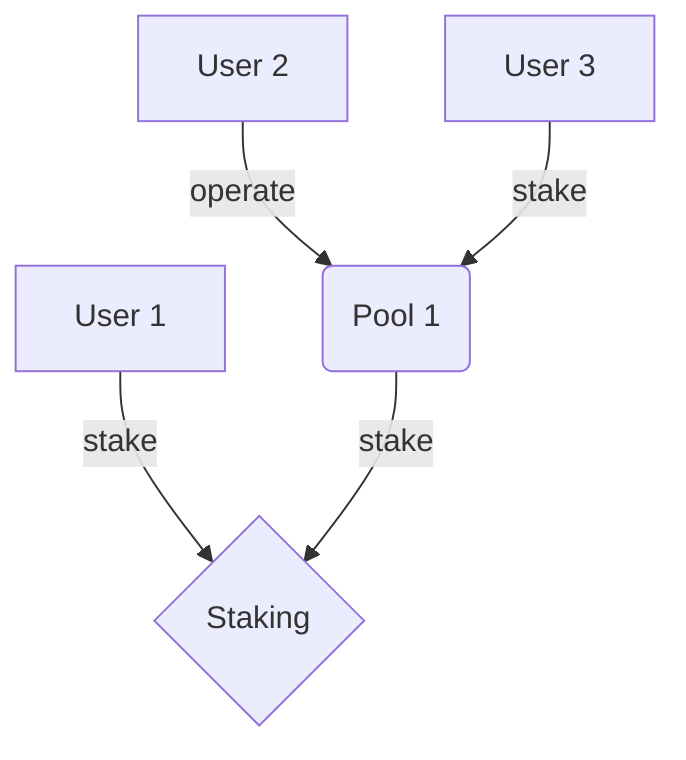

# ctsi-staking

This strategy implements the rules of CTSI Staking, returning the staked balance of the voters. It supports direct staking, as well as delegated staking through staking pools.

There are no parameters to configure.

The diagram below represents Cartesi Staking system:

Cartesi staking system is primarily consolidated in the [StakingImpl contract](https://etherscan.io/address/0x9EdEAdFDE65BCfD0907db3AcdB3445229c764A69#readContract). Stakers to this contract can be EOA who stake directly, as the `User 1` above, or can be a [Staking Pool](https://github.com/cartesi/staking-pool), as the `Pool 1` above.

Staking Pools are smart contracts, so in this case the voting power is delegated to its operator, given by the `owner` of the pool smart contract, represented by `User 2` above.

Those users who do not wish to stake directly or operate a pool can stake to a pool instead, like the `User 3` represented in the diagram. As described above, pool operators accumulates the voting power of all its stakers.

Note that an EOA can be at the same time a direct staker and a pool operator. Voting powers are accumulated.
